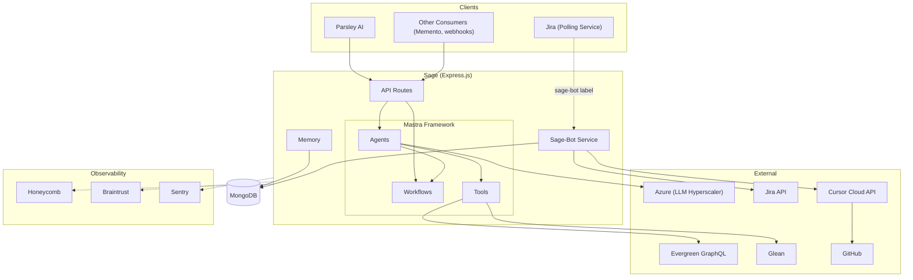
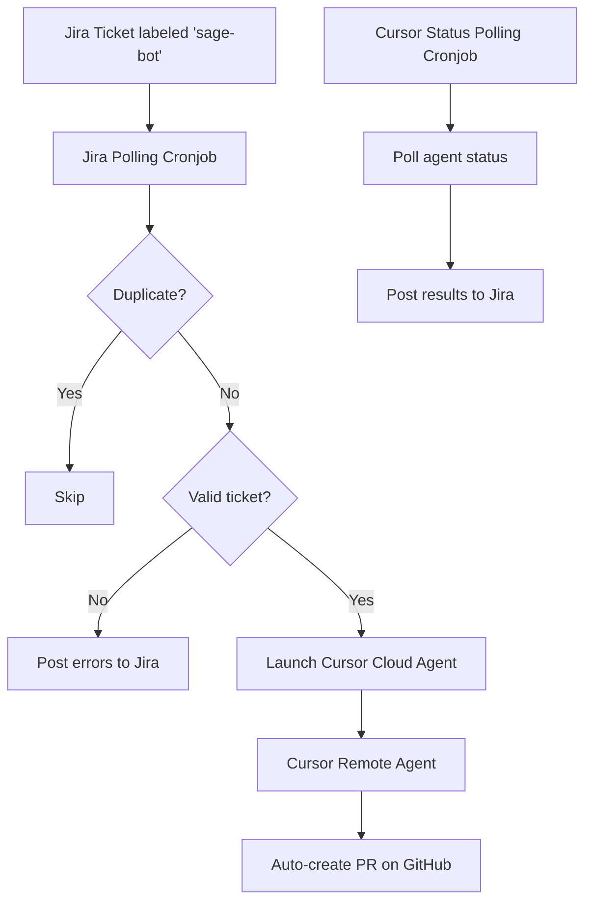
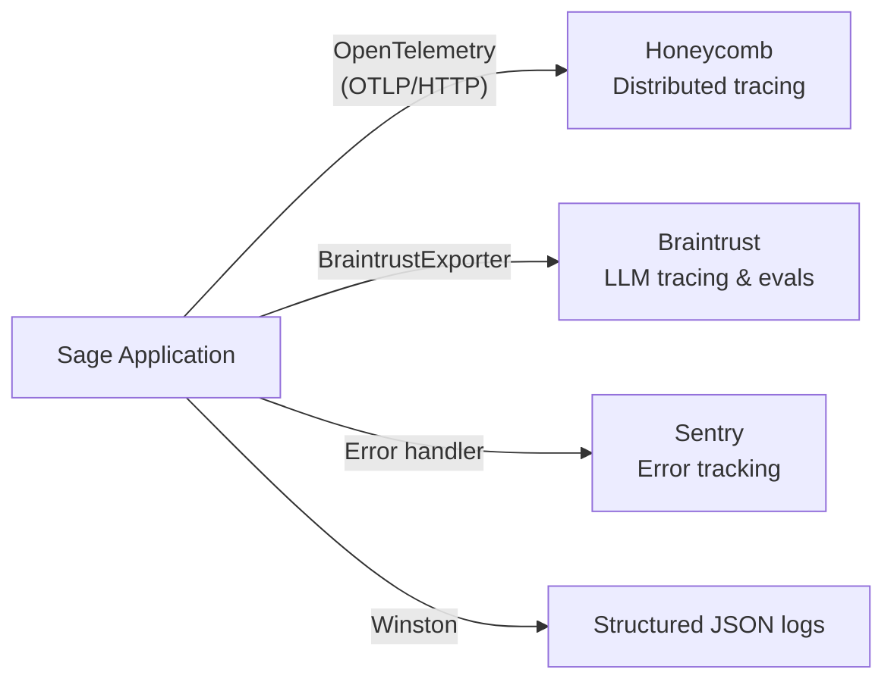

# Sage Architecture

Sage is DevProd's agentic infrastructure platform, built on the [Mastra framework](https://mastra.ai/). It coordinates multiple specialized agents, tools, and workflows to power AI features across DevProd products.

## High-Level Architecture



## API Products

Sage exposes five products, each solving a distinct problem for DevProd teams:

- **Parsley AI** (`/completions/parsley/*`) — Conversational debugging of CI task failures and logs. Backed by the SageThinkingAgent, it cross-references task metadata with log contents and streams responses via SSE so users get answers incrementally. Queries Evergreen's GraphQL API for task data.

- **Memento** (`/completions/memento/*`) — Useful context about bugs and feature requests often lives in Slack threads that never make it into Jira. Memento uses the SlackThreadSummarizerAgent to convert raw Slack thread captures into structured Jira-ready summaries with a reporter, title, and description.

- **Lumber** (`/completions/lumber/*`) — Questions posted in #ask-devprod need to reach the right team quickly. Lumber's QuestionOwnershipAgent classifies incoming questions and routes them to the appropriate DevProd team with a reasoning explanation.

- **Release Notes** (`/completions/release-notes/*`) — Writing release notes from dozens of Jira issues is tedious and error-prone. The releaseNotesWorkflow automates this by generating structured, citation-backed release notes that map issues to user-facing sections.

- **Sage-Bot** (Cronjob) — For straightforward implementation tasks, Sage-Bot can generate a PR directly from a Jira ticket. It polls Jira for `sage-bot`-labeled tickets and launches Cursor Cloud Agents to create pull requests automatically.

---

## Parsley AI Internals

### Orchestration Flow

```
User Question
    |
    v
[Route] — validates request, pre-resolves log URL if metadata provided
    |
    v
[Orchestrator Agent] — reasons about the question, builds a plan
    |
    |-- [Question Classifier] (agent-as-tool)
    |       decides: metadata query? log analysis? both? general knowledge?
    |
    |-- [Evergreen Agent] (agent-as-tool)
    |       fetches task/test/version data via GraphQL
    |
    |-- [Log Analyzer] (workflow-as-tool)
    |       loads, chunks, and analyzes log content
    |
    |-- [Log URL Resolver] (workflow-as-tool)
    |       turns Evergreen metadata into a downloadable log URL
    |
    v
Streamed response
```

### Orchestration

The sageThinkingAgent is the central [orchestrator](https://mastra.ai/docs/agents/overview) with thread-scoped [working memory](https://mastra.ai/docs/memory/working-memory) so it can reference earlier messages in a conversation. When a message arrives, it builds an internal checklist, invokes specialists as needed, validates outcomes, and assembles a final answer.

The key insight is that the orchestrator doesn't contain domain logic itself — it delegates everything to specialists and focuses purely on reasoning about _which_ specialist to call and _how_ to combine their results.

### Composition Patterns

#### Agent-as-Tool

Sub-agents (Question Classifier, Evergreen Agent) are wrapped as [tools](https://mastra.ai/docs/agents/using-tools) so the orchestrator invokes them through the standard tool-calling interface. This means adding a new specialist doesn't require changing the orchestrator's code — just register a new tool.

#### Workflow-as-Tool

Multi-step [workflows](https://mastra.ai/docs/workflows/overview) (Log Analyzer, Log URL Resolver) are also exposed as tools. From the orchestrator's perspective, running a multi-step log analysis pipeline looks the same as calling any other tool. The workflow's internal complexity is fully encapsulated.

> **Why wrap everything as tools?** The orchestrator model already knows how to reason about tool calls — when to call them, how to interpret results, and when to combine results from multiple calls. By presenting sub-agents and workflows as tools, we get this reasoning for free instead of building custom orchestration logic.

### Tiered Model Strategy

Evergreen logs can be tens of megabytes. The Log Analyzer workflow handles this by splitting files into token-aware chunks and using a tiered model strategy:

1. **First chunk** — analyzed by the full-power model to establish a thorough baseline
2. **Subsequent chunks** — processed by a smaller, cheaper model that merges new findings into the running analysis
3. **Final report** — formatted by the full-power model into user-facing markdown

> **Why use a cheaper model for refinement?** Once the initial analysis establishes the structure and key findings, subsequent chunks mostly need to identify new occurrences of known patterns or flag genuinely new issues. The smaller model handles this well at a fraction of the cost, which matters when a large log file produces dozens of chunks.

### Question Classification

Not every question requires the same tools. The Question Classifier Agent inspects each question and decides the fastest path to an answer:

| Class               | Description                          | Example                                                            | Action                   |
| ------------------- | ------------------------------------ | ------------------------------------------------------------------ | ------------------------ |
| `EVERGREEN`         | Metadata-only questions              | "What's the status of task X?"                                     | Use Evergreen Agent      |
| `LOG`               | Requires reading/analyzing logs      | "Why did test A fail in task T?"                                   | Use Log Core Analyzer    |
| `COMBINATION`       | Needs both metadata and log analysis | "Was this failure introduced recently? Compare with last passing." | Use both agents          |
| `CAN_ANSWER_ON_OWN` | General knowledge                    | "What does task status 'undispatched' mean?"                       | Generate answer directly |
| `IRRELEVANT`        | Out of scope                         | "Write me a poem"                                                  | Decline to answer        |

**Edge cases:**

- If the user mentions a specific task/run/test and asks "why/where/how it failed," the question is classified as `LOG`
- If ambiguous between `EVERGREEN` and `LOG`, the classifier prefers `COMBINATION`
- Questions clearly unrelated to Evergreen are classified as `IRRELEVANT`

### Request Context

Every request carries context that flows through agents, tools, and workflow steps. Mastra's [RequestContext](https://mastra.ai/docs/server/request-context) carries user ID, log metadata, and pre-resolved log URLs, while AsyncLocalStorage maintains request-scoped IDs across async boundaries for logging and tracing.

### Streaming

Agent responses are streamed to the client via SSE so users see partial answers as they're generated rather than waiting for the full response.

### Memory

Parsley AI needs to remember earlier messages in a conversation so users can ask follow-up questions like "what about the other test?" without restating context. Each conversation maintains thread-scoped [working memory](https://mastra.ai/docs/memory/working-memory) via Mastra Memory backed by MongoDB, where the thread ID maps to the client's conversation ID.

---

## Agents

Sage's agents and workflows are registered in `src/mastra/index.ts` and invoked through API routes. Each agent focuses on a specific domain.

| Agent / Workflow           | Type     | Purpose                                                                                                           |
| -------------------------- | -------- | ----------------------------------------------------------------------------------------------------------------- |
| SageThinkingAgent          | Agent    | Orchestrates Parsley AI — classifies questions, delegates to specialists, assembles answers                       |
| QuestionClassifierAgent    | Agent    | Classifies user questions to determine the right specialist                                                       |
| EvergreenAgent             | Agent    | Fetches task/test/version metadata via Evergreen GraphQL                                                          |
| SlackThreadSummarizerAgent | Agent    | Converts Slack thread captures into structured Jira ticket data                                                   |
| QuestionOwnershipAgent     | Agent    | Routes #ask-devprod questions to the appropriate DevProd team. Prompt managed in Braintrust for code-free updates |
| ReleaseNotesAgent          | Agent    | Generates release note copy from Jira issue data                                                                  |
| releaseNotesWorkflow       | Workflow | Orchestrates release note generation: plans sections, generates copy, validates citations                         |
| logCoreAnalyzerWorkflow    | Workflow | Analyzes log files with chunked processing and tiered model strategy                                              |
| logUrlResolverWorkflow     | Workflow | Resolves Evergreen metadata into downloadable log URLs                                                            |

---

## Sage-Bot & Cursor Remote Agents

Many DevProd tasks are well-defined enough that an AI agent can implement them directly from a Jira ticket description. Sage-Bot bridges Jira and Cursor Cloud Agents so that developers can describe work in a ticket, add a label, and get a PR back without writing code themselves.

### Pipeline



**Validation checks:** The ticket must have a repo label (e.g., `repo:mongodb/mongo`), an assignee, and the assignee must have a stored Cursor API key.

**Credential management:** Users store their Cursor API keys via `/pr-bot/user/cursor-key`. Keys are encrypted at rest using AES-256 before being stored in MongoDB.

---

## Observability

Because Sage orchestrates multiple LLM calls, workflows, and external APIs per request, understanding what happened when something goes wrong requires layered observability. The stack covers distributed tracing, error tracking, eval scoring, and structured logging.



### Honeycomb (OpenTelemetry)

Honeycomb provides distributed tracing so you can follow a single user request across Express routes, agent calls, and MongoDB queries.

### Braintrust

Braintrust serves a dual role. First, all LLM calls are traced, giving visibility into model inputs, outputs, and latency. Second, some agents load their system prompts from Braintrust at runtime, so the team can iterate on prompts without deploying code. Braintrust also hosts the eval suite, which produces scores and JUnit XML reports for CI.

> **Why Braintrust for prompts?** Storing prompts externally lets the team experiment with prompt changes and measure their impact through A/B comparisons in Braintrust, without going through the full deploy cycle.

### Sentry

Sentry captures unhandled exceptions, rejections, and Express errors with transaction tracing. Middleware sets the authenticated user on each scope, making it easy to trace errors back to specific users.

## Eval Suite (Braintrust)

LLM outputs are non-deterministic, so every agent and workflow has a corresponding eval suite that scores outputs against known test cases. This catches regressions when prompts, models, or tools change.

Evals report to the Braintrust project `sage-prod` and generate JUnit XML for CI integration. For implementation details on writing new evals, see the [Creating Evals](agents.md#creating-evals) section in agents.md.

## Data Layer

MongoDB serves as the primary data store. Each collection has a focused purpose:

| Collection                | Purpose                                                        |
| ------------------------- | -------------------------------------------------------------- |
| **Mastra Memory Threads** | Conversation history and thread metadata for Parsley AI        |
| **User Credentials**      | Encrypted Cursor API keys (AES-256) for sage-bot users         |
| **Job Runs**              | Sage-bot execution records for idempotency and status tracking |
