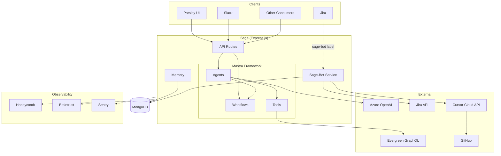
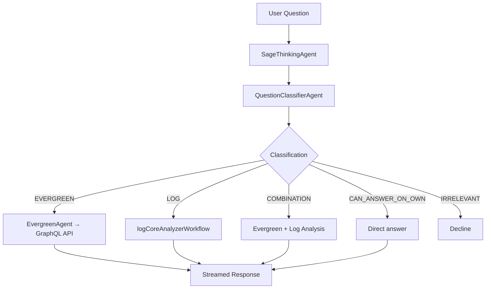
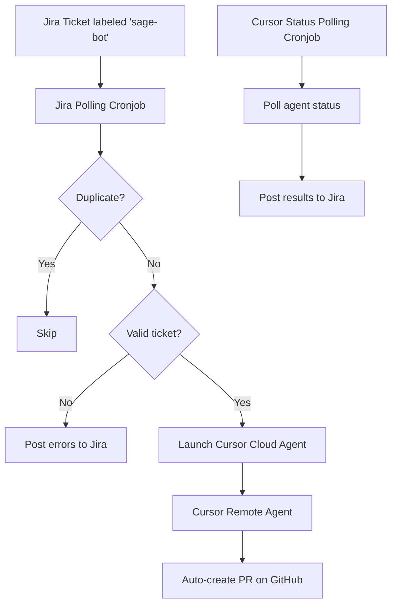
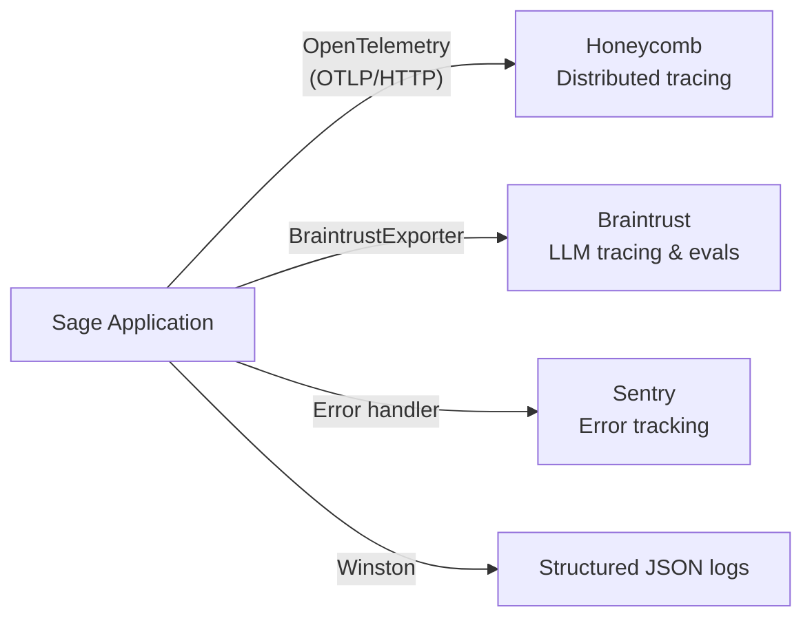

# Sage Architecture

Sage is an AI agent orchestrator built on the [Mastra framework](https://mastra.ai/). It coordinates multiple specialized agents, tools, and workflows to power DevProd's AI features across the Evergreen ecosystem.

## High-Level Architecture

```mermaid
graph TD
    subgraph Clients
        Parsley["Parsley UI"]
        Slack["Slack"]
        Jira["Jira"]
        Other["Other Consumers"]
    end

    subgraph Sage["Sage (Express.js)"]
        API["API Routes"]
        subgraph Mastra["Mastra Framework"]
            Agents["Agents"]
            Workflows["Workflows"]
            Tools["Tools"]
        end
        SageBotSvc["Sage-Bot Service"]
        Memory["Memory"]
    end

    subgraph External
        AzureOAI["Azure OpenAI"]
        Evergreen["Evergreen GraphQL"]
        JiraAPI["Jira API"]
        CursorAPI["Cursor Cloud API"]
        GitHub["GitHub"]
    end

    subgraph Observability
        Honeycomb["Honeycomb"]
        Braintrust["Braintrust"]
        Sentry["Sentry"]
    end

    MongoDB[("MongoDB")]

    Parsley --> API
    Slack --> API
    Other --> API
    Jira -.->|"sage-bot label"| SageBotSvc

    API --> Agents
    API --> Workflows
    Agents --> Tools
    Agents --> Workflows
    Agents --> AzureOAI
    Tools --> Evergreen
    SageBotSvc --> JiraAPI
    SageBotSvc --> CursorAPI
    CursorAPI --> GitHub
    Memory --> MongoDB
    SageBotSvc --> MongoDB

    Sage -.-> Honeycomb
    Sage -.-> Braintrust
    Sage -.-> Sentry
```

## API Products

Sage exposes five products, each solving a distinct problem for DevProd teams:

- **[Parsley AI](./parsley/index.md)** (`/completions/parsley/*`) — When developers are debugging Evergreen task failures, they often need to cross-reference task metadata with log contents. Parsley AI provides a conversational interface backed by the SageThinkingAgent that handles both, streaming responses via SSE so users get answers incrementally.

- **[Memento](./memento/index.md)** (`/completions/memento/*`) — Useful context about bugs and feature requests often lives in Slack threads that never make it into Jira. Memento uses the SlackThreadSummarizerAgent to convert raw Slack thread captures into structured Jira-ready summaries with a reporter, title, and description.

- **[Lumber](./lumber/index.md)** (`/completions/lumber/*`) — Questions posted in #ask-devprod need to reach the right team quickly. Lumber's QuestionOwnershipAgent classifies incoming questions and routes them to the appropriate DevProd team with a reasoning explanation.

- **[Release Notes](./release-notes/index.md)** (`/completions/release-notes/*`) — Writing release notes from dozens of Jira issues is tedious and error-prone. The releaseNotesWorkflow automates this by generating structured, citation-backed release notes that map issues to user-facing sections.

- **[Sage-Bot](./sage-bot/index.md)** (Cronjob) — For straightforward implementation tasks, Sage-Bot can generate a PR directly from a Jira ticket. It polls Jira for `sage-bot`-labeled tickets and launches Cursor Cloud Agents to create pull requests automatically.

## SageThinkingAgent (Parsley AI)

When a user asks a question in Parsley, it could be about task metadata ("what's the status of this task?"), log contents ("why did this test fail?"), or both. Rather than requiring the user to know which system to query, the SageThinkingAgent figures out what kind of question was asked and delegates to the right specialist, assembling a single coherent answer.

### Orchestration Flow

```mermaid
flowchart TD
    User["User Question"] --> STA["SageThinkingAgent"]
    STA --> QCA["QuestionClassifierAgent"]
    QCA --> Decision{Classification}

    Decision -->|EVERGREEN| EGA["EvergreenAgent → GraphQL API"]
    Decision -->|LOG| LogWF["logCoreAnalyzerWorkflow"]
    Decision -->|COMBINATION| Both["Evergreen + Log Analysis"]
    Decision -->|CAN_ANSWER_ON_OWN| Direct["Direct answer"]
    Decision -->|IRRELEVANT| Decline["Decline"]

    EGA --> Response["Streamed Response"]
    LogWF --> Response
    Both --> Response
    Direct --> Response
```

The SageThinkingAgent uses two composition patterns to delegate work:

- **Agent-as-tool** — Sub-agents (Question Classifier, Evergreen Agent) are wrapped as [tools](https://mastra.ai/docs/agents/using-tools) so the orchestrator can invoke them as standard tool calls.
- **Workflow-as-tool** — Multi-step [workflows](https://mastra.ai/docs/workflows/overview) (Log Analyzer, Log URL Resolver) are exposed as tools, keeping their internal complexity encapsulated.

> **Why these patterns?** Wrapping sub-agents and workflows as tools lets the orchestrator invoke them through the standard tool-calling interface. This keeps the orchestrator's reasoning loop simple — it just decides which "tool" to call — while the actual complexity lives inside each sub-agent or workflow. It also means sub-agents can be tested and evolved independently.

### Memory

Parsley AI needs to remember earlier messages in a conversation so users can ask follow-up questions like "what about the other test?" without restating context. Each conversation maintains thread-scoped [working memory](https://mastra.ai/docs/memory/working-memory) via Mastra Memory backed by MongoDB, where the thread ID maps to the client's conversation ID.

## Sage-Bot & Cursor Remote Agents

Many DevProd tasks are well-defined enough that an AI agent can implement them directly from a Jira ticket description. Sage-Bot bridges Jira and Cursor Cloud Agents so that developers can describe work in a ticket, add a label, and get a PR back without writing code themselves.

### Pipeline

```mermaid
flowchart TD
    Ticket["Jira Ticket labeled 'sage-bot'"] --> Poll["Jira Polling Cronjob"]
    Poll --> Dup{"Duplicate?"}
    Dup -->|Yes| Skip["Skip"]
    Dup -->|No| Validate{"Valid ticket?"}

    Validate -->|No| Error["Post errors to Jira"]
    Validate -->|Yes| Launch["Launch Cursor Cloud Agent"]

    Launch --> Agent["Cursor Remote Agent"]
    Agent --> PR["Auto-create PR on GitHub"]

    StatusPoll["Cursor Status Polling Cronjob"] --> Status["Poll agent status"]
    Status --> Comment["Post results to Jira"]
```

**Validation checks:** The ticket must have a repo label (e.g., `repo:mongodb/mongo`), an assignee, and the assignee must have a stored Cursor API key.

**Credential management:** Users store their Cursor API keys via `/pr-bot/user/cursor-key`. Keys are encrypted at rest using AES-256 before being stored in MongoDB.

## Observability

Because Sage orchestrates multiple LLM calls, workflows, and external APIs per request, understanding what happened when something goes wrong requires layered observability. The stack covers distributed tracing, error tracking, eval scoring, and structured logging.

```mermaid
graph LR
    Sage["Sage Application"]

    Sage -->|"OpenTelemetry\n(OTLP/HTTP)"| Honeycomb["Honeycomb\nDistributed tracing"]
    Sage -->|"BraintrustExporter"| Braintrust["Braintrust\nLLM tracing & evals"]
    Sage -->|"Error handler"| Sentry["Sentry\nError tracking"]
    Sage -->|"Winston"| Logs["Structured JSON logs"]
```

### Honeycomb (OpenTelemetry)

Honeycomb provides distributed tracing so you can follow a single user request across Express routes, agent calls, and MongoDB queries.

### Braintrust

Braintrust serves a dual role. First, all LLM calls are traced, giving visibility into model inputs, outputs, and latency. Second, some agents load their system prompts from Braintrust at runtime, so the team can iterate on prompts without deploying code. Braintrust also hosts the eval suite, which produces scores and JUnit XML reports for CI.

> **Why Braintrust for prompts?** Storing prompts externally lets the team experiment with prompt changes and measure their impact through A/B comparisons in Braintrust, without going through the full deploy cycle.

### Sentry

Sentry captures unhandled exceptions, rejections, and Express errors with transaction tracing. Middleware sets the authenticated user on each scope, making it easy to trace errors back to specific users.

## Eval Suite (Braintrust)

LLM outputs are non-deterministic, so every agent and workflow has a corresponding eval suite that scores outputs against known test cases. This catches regressions when prompts, models, or tools change.

Evals report to the Braintrust project `sage-prod` and generate JUnit XML for CI integration. For implementation details on writing new evals, see the [Creating Evals](../agents.md#creating-evals) section in agents.md.

## Data Layer

MongoDB serves as the primary data store. Each collection has a focused purpose:

| Collection                | Purpose                                                        |
| ------------------------- | -------------------------------------------------------------- |
| **Mastra Memory Threads** | Conversation history and thread metadata for Parsley AI        |
| **User Credentials**      | Encrypted Cursor API keys (AES-256) for sage-bot users         |
| **Job Runs**              | Sage-bot execution records for idempotency and status tracking |
