# Sage Architecture

Sage is an AI agent orchestrator built on the [Mastra framework](https://mastra.ai/). It coordinates multiple specialized agents, tools, and workflows to power DevProd's AI features across the Evergreen ecosystem.

## High-Level Architecture

## API Products

Sage exposes five products, each backed by a dedicated agent or workflow:

| Product           | Route                          | Agent / Workflow           | Description                                                                                         |
| ----------------- | ------------------------------ | -------------------------- | --------------------------------------------------------------------------------------------------- |
| **Parsley AI**    | `/completions/parsley/*`       | SageThinkingAgent          | Interactive conversational AI for Evergreen task and log analysis. Streams responses via SSE.       |
| **Memento**       | `/completions/memento/*`       | SlackThreadSummarizerAgent | Converts Slack thread captures into structured Jira-ready summaries (reporter, title, description). |
| **Lumber**        | `/completions/lumber/*`        | QuestionOwnershipAgent     | Classifies questions and routes them to the appropriate DevProd team.                               |
| **Release Notes** | `/completions/release-notes/*` | releaseNotesWorkflow       | Generates structured, citation-backed release notes from Jira issues.                               |
| **Sage-Bot**      | Cronjob (Jira polling)         | Cursor Remote Agent        | Polls Jira for `sage-bot`-labeled tickets and launches Cursor Cloud Agents to create PRs.           |

## SageThinkingAgent (Parsley AI)

The SageThinkingAgent is the central orchestrator for the Parsley AI chat experience. It reasons about user questions and delegates to specialized sub-agents and workflows.

### Orchestration Flow

```mermaid
flowchart TD
    User["User Question"] --> STA["SageThinkingAgent"]
    STA --> QCA["QuestionClassifierAgent"]
    QCA --> Decision{Classification}

    Decision -->|EVERGREEN| EGA["EvergreenAgent → GraphQL API"]
    Decision -->|LOG| LogWF["logCoreAnalyzerWorkflow"]
    Decision -->|COMBINATION| Both["Evergreen + Log Analysis"]
    Decision -->|CAN_ANSWER_ON_OWN| Direct["Direct answer"]
    Decision -->|IRRELEVANT| Decline["Decline"]

    EGA --> Response["Streamed Response"]
    LogWF --> Response
    Both --> Response
    Direct --> Response
```

The SageThinkingAgent uses two composition patterns to delegate work:

- **Agent-as-tool** -- QuestionClassifierAgent and EvergreenAgent are wrapped as tools (`askQuestionClassifierAgentTool`, `askEvergreenAgentTool`) so the orchestrator can invoke them as standard tool calls.
- **Workflow-as-tool** -- `logCoreAnalyzerWorkflow` and `getLogFileUrlWorkflow` are exposed as tools (`logCoreAnalyzerTool`, `resolveLogFileUrlTool`), keeping multi-step logic encapsulated.

### Memory

Each conversation maintains thread-scoped working memory via Mastra Memory backed by MongoDB. The thread ID corresponds to the conversation ID from the client, enabling multi-turn conversations with full context.

## Sage-Bot & Cursor Remote Agents

Sage-Bot is an automated PR generation system that bridges Jira and Cursor Cloud Agents.

### Pipeline

**Validation checks:** The ticket must have a repo label (e.g., `repo:mongodb/mongo`), an assignee, and the assignee must have a stored Cursor API key.

**Credential management:** Users store their Cursor API keys via `/pr-bot/user/cursor-key`. Keys are encrypted at rest using AES-256 before being stored in MongoDB.

## Observability

Sage uses a layered observability stack covering tracing, error tracking, eval scoring, and structured logging.

### Honeycomb (OpenTelemetry)

- **Protocol:** OTLP over HTTP with W3C Trace Context propagation
- **Instrumented:** Express routes, MongoDB queries
- **Context:** `AsyncLocalStorageContextManager` for async context propagation

### Braintrust

- **Tracing:** All LLM calls are traced via the `BraintrustExporter` configured in Mastra's observability layer
- **Dynamic Prompts:** Some agents (e.g., QuestionOwnershipAgent) load their system prompts from Braintrust at runtime via `loadPrompt()`, enabling prompt iteration without code deploys
- **Eval Suite:** Comprehensive evaluations for every agent and workflow, producing scores and JUnit XML reports

### Sentry

- **Error Tracking:** Captures unhandled exceptions, rejections, and Express errors
- **Transaction Tracing:** Samples a configurable percentage of requests (default 10%)
- **Console Capture:** Experimental integration captures `console.log/warn/error` as Sentry logs
- **User Context:** Middleware sets the authenticated user on the Sentry scope for each request

## Eval Suite (Braintrust)

Every agent and workflow has a corresponding eval suite that scores outputs against test cases.

| Eval                         | What It Tests                                          |
| ---------------------------- | ------------------------------------------------------ |
| `sageThinkingAgent`          | End-to-end reasoning quality and tool usage            |
| `questionClassifierAgent`    | Classification accuracy across question types          |
| `evergreenAgent`             | Correctness of GraphQL queries and data interpretation |
| `logAnalyzerWorkflow`        | Log analysis completeness and accuracy                 |
| `slackThreadSummarizerAgent` | Summary quality and Jira formatting                    |
| `questionOwnershipAgent`     | Team routing correctness                               |
| `releaseNotesWorkflow`       | Structure, citation validity, and content quality      |

Evals report to the Braintrust project `sage-prod` and generate JUnit XML for CI integration.

## Data Layer

MongoDB serves as the primary data store with the following collections:

| Collection                | Purpose                                                        |
| ------------------------- | -------------------------------------------------------------- |
| **Mastra Memory Threads** | Conversation history and thread metadata for Parsley AI        |
| **User Credentials**      | Encrypted Cursor API keys (AES-256) for sage-bot users         |
| **Job Runs**              | Sage-bot execution records for idempotency and status tracking |

## Key Source Locations

| Component                               | Location                   |
| --------------------------------------- | -------------------------- |
| Application entry point                 | `src/main.ts`              |
| Express server & routes                 | `src/api-server/`          |
| Mastra registration (agents, workflows) | `src/mastra/index.ts`      |
| Agent implementations                   | `src/mastra/agents/`       |
| Tool implementations                    | `src/mastra/tools/`        |
| Workflow implementations                | `src/mastra/workflows/`    |
| Cursor service                          | `src/services/cursor/`     |
| Jira service & polling                  | `src/services/jira/`       |
| Eval suite                              | `src/evals/`               |
| OpenTelemetry setup                     | `src/instrumentation.ts`   |
| Sentry setup                            | `src/sentry-instrument.ts` |
| Config & environment                    | `src/config/index.ts`      |
| Database connection                     | `src/db/connection.ts`     |
